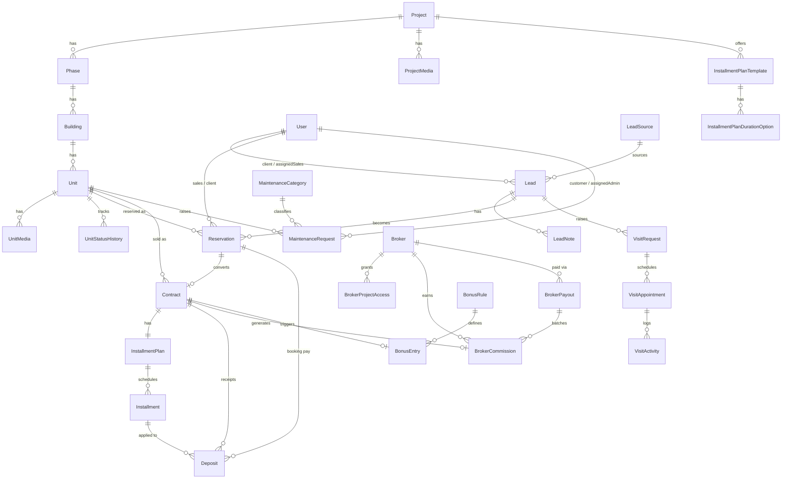
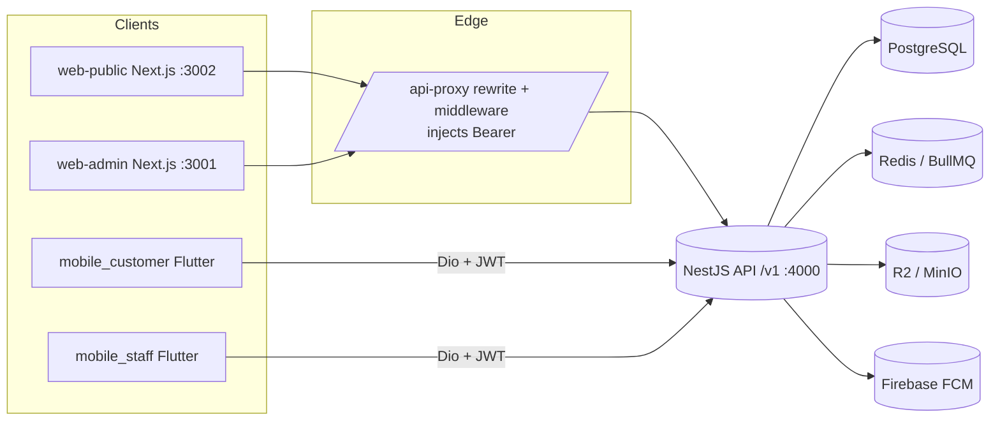

# Project State Report — Real Estate Platform ("Devora")

> Generated: 2026-06-06 · Read-only technical audit · No production code was modified.
> All counts and claims below are evidence-based (file paths cited). Where something
> could not be confirmed it is marked **(unclear)** rather than guessed.

---

## 1. Executive Summary

This repository is a **four-surface real-estate platform** branded **"Devora"**, built as a
single **pnpm + Turborepo monorepo**. The four product surfaces are:

| Surface | Tech | Maturity |
| --- | --- | --- |
| **Backend API** (`apps/api`) | NestJS 10 · Prisma 5 · PostgreSQL · Redis/BullMQ · S3/R2 · Firebase | **Mature** — 38 modules, 18 controllers, 96 test files, 33 migrations |
| **Admin Dashboard** (`apps/web-admin`) | Next.js 15 (App Router) · React 19 · Tailwind | **Mature** — 106 page routes, full CRUD across all domains |
| **Public Website** (`apps/web-public`) | Next.js 15 (App Router) · React 19 · Tailwind · ISR | **Mature** — 26 page routes, catalog + customer account portal |
| **Mobile** (`apps/mobile`) | Flutter 3 · BLoC · GoRouter · Dio | **Mature** — two apps (Customer 218 Dart files, Staff 236), clean architecture |

**Overall state:** This is a **substantially complete, well-architected, multi-phase product**, not
an early prototype. The original README describes a 4-phase plan ("Phase 1 Backend+Admin" being the
"current" phase), but the actual code has advanced **far beyond** that README — both mobile apps are
built, the public site has a full customer portal, brokers/commissions/payouts are implemented, an AI
chat module exists, and there is a real CI matrix with e2e tests. **The README is stale relative to
the codebase** (it still lists web-public and mobile as future phases).

**Key strengths:**
- Consistent layered architecture across all four surfaces.
- Strong domain modelling (57 Prisma models, 47 enums) covering the full real-estate lifecycle:
  catalog → leads → visits → reservations → contracts → installments/deposits → maintenance, plus a
  full **broker/commission/payout** subsystem.
- Security hygiene: argon2 password hashing, JWT access+refresh with rotation, httpOnly cookies on web,
  secure storage on mobile, Helmet, rate limiting, env validation, no committed secrets found.
- Real test coverage: backend unit+e2e (Jest), web e2e (Playwright), mobile analyze+unit (Flutter).
- Bilingual (Arabic/English) with RTL throughout; translatable `{ar,en}` JSON fields in the DB.

**Key risks (detail in §15):** stale top-level docs, some legacy/v2 field duplication in the schema
(`VisitRequest`), a polymorphic `Document` table with no DB-level FK, client-side payment-calculator
duplication, push notifications (FCM) scaffolded but not delivering, and no SAST/dependency scanning in CI.

---

## 2. Repository Structure

**This is a monorepo** (single git repo, multiple workspaces) managed by **pnpm workspaces** +
**Turborepo**. The JS/TS side is one pnpm workspace; the Flutter side is a **separate Dart
pub-workspace** (Melos) nested under `apps/mobile`.

```
Real Estate/
├── apps/
│   ├── api/            NestJS 10 backend (Prisma, modules, e2e tests)        [@rep/api]
│   ├── web-admin/      Next.js 15 admin dashboard + broker portal (port 3001)
│   ├── web-public/     Next.js 15 marketing site + customer account (port 3002)
│   └── mobile/         Flutter Dart workspace (Melos)
│       ├── packages/core/   shared design system, network, auth, l10n, state
│       ├── mobile_customer/ Customer/Client app (218 Dart files)
│       └── mobile_staff/    Sales/Broker/Manager/Maintenance app (236 Dart files)
├── packages/
│   ├── shared-types/   @rep/shared-types — Zod schemas + TS types shared by JS apps
│   ├── tsconfig/       @rep/tsconfig — base/nest/next TS configs
│   └── (eslint-config) placeholder per README (not present as a folder)
├── docs/               18 markdown docs (QA strategy, readiness checklists, ADRs)
│   ├── adr/            1 ADR: 0001-mobile-clean-architecture.md
│   └── brand/          brand assets
├── scripts/            release-verify.sh
├── .github/workflows/  ci.yml (single CI workflow, multi-job matrix)
├── docker-compose.yml  postgres + redis + minio + api + web-admin
├── turbo.json          Turbo task graph (build/dev/lint/typecheck/test)
├── pnpm-workspace.yaml  workspaces: apps/api, apps/web-public, apps/web-admin, packages/*
└── README.md           (stale — describes pre-mobile phase plan)
```

> Note: `pnpm-workspace.yaml` lists only `apps/api`, `apps/web-public`, `apps/web-admin`, and
> `packages/*`. `apps/mobile` is intentionally **not** a JS workspace member — it is governed by its
> own Dart workspace and Melos tooling.

**Directory responsibilities:**

| Path | Responsibility |
| --- | --- |
| `apps/api/src/modules/*` | One folder per domain (38 modules); each holds controller/service/DTOs/tests |
| `apps/api/prisma/` | `schema.prisma` (1,794 lines), 33 migrations, `seed.ts`, `seed-e2e.ts` |
| `apps/web-admin/src/app/dashboard/*` | Admin pages (RBAC: ADMIN/SALES/SALES_MANAGER) |
| `apps/web-admin/src/app/portal/*` | Broker self-service workspace |
| `apps/web-public/src/app/account/*` | Authenticated customer portal (CLIENT vs CUSTOMER) |
| `apps/mobile/packages/core` | Shared Flutter design system + infra (network, auth, l10n) |
| `packages/shared-types` | Cross-app Zod/TS contract types |

---

## 3. Tech Stack

### Backend (`apps/api/package.json`)
| Concern | Technology | Evidence |
| --- | --- | --- |
| Framework | **NestJS 10.4.15** (`@nestjs/core`, `common`, `platform-express`) | package.json |
| ORM / DB | **Prisma 5.22** over **PostgreSQL** | `@prisma/client`, `schema.prisma` `provider = "postgresql"` |
| Auth | `@nestjs/jwt`, `@nestjs/passport`, `passport-jwt`, **argon2** hashing | auth module |
| Queue/Cache | **Redis** via `ioredis` + **BullMQ** (`@nestjs/bullmq`) | package.json |
| Scheduling | `@nestjs/schedule` (cron) | installments module crons |
| Storage | **S3-compatible** via `@aws-sdk/client-s3` + `s3-request-presigner` (Cloudflare R2 / MinIO) | media module `r2.service.ts` |
| Push | **Firebase Admin** (`firebase-admin`) FCM | `common/firebase/firebase.service.ts` |
| Email/SMS | `nodemailer` (SMTP), Twilio (OTP, via env provider) | env validation |
| Validation | **class-validator** + class-transformer (DTOs); **zod** for env | global ValidationPipe |
| Docs | **Swagger** (`@nestjs/swagger`) at `/docs` | main.ts |
| Security | **Helmet**, `@nestjs/throttler` (rate limit), cookie-parser | main.ts |
| Observability | **Sentry** (`@sentry/node`), structured JSON logger | main.ts |
| Reports | `exceljs`, `chart.js`, `@napi-rs/canvas` | reports module |
| Testing | **Jest** + ts-jest + supertest | jest.config.js |

### Web — Admin & Public (`apps/web-*/package.json`)
| Concern | Technology | Evidence |
| --- | --- | --- |
| Framework | **Next.js 15.1.0** (App Router) + **React 19** | package.json |
| Styling | **Tailwind CSS 3.4** + `@tailwindcss/forms`, `clsx`, `tailwind-merge` | tailwind.config.ts |
| Icons | `lucide-react` | package.json |
| Charts (admin) | **Recharts** | dashboard components |
| Maps (admin) | `@react-google-maps/api` | project map components |
| Drag&drop (admin) | `@dnd-kit/core` (lead kanban) | crm components |
| Theming (public) | `next-themes` (dark mode) | layout providers |
| State | **No global store** — React server components + server actions + `useActionState`; small client `useState`/Context (Favorites, Compare, Theme) | api.ts, providers |
| Data fetch | Custom server-side fetch wrapper → `/v1` API; `/api-proxy/*` rewrite injects JWT | `src/lib/api.ts`, `middleware.ts` |
| i18n | **Admin:** Arabic-first RTL hardcoded. **Public:** native Arabic RTL, **no next-intl** despite README claim | layout.tsx |
| Monitoring | `@sentry/nextjs` (optional) | next.config.ts |
| Testing | **Playwright** e2e | playwright.config.ts |

> README discrepancy: README says public site uses `next-intl (ar/en)`. In the current code,
> `web-public` has **no `next-intl` dependency** — Arabic/RTL is hardcoded and copy is inline Arabic.

### Mobile (`apps/mobile/**/pubspec.yaml`)
| Concern | Technology | Evidence |
| --- | --- | --- |
| Framework | **Flutter / Dart SDK ^3.10.7** | pubspec.yaml |
| State mgmt | **flutter_bloc / bloc** (Cubit + Bloc) — **not Riverpod** (README is wrong here too) | core package |
| Navigation | **go_router 14** (`StatefulShellRoute`) | router/app_router.dart |
| Networking | **dio 5** + interceptors (Auth, RequestId, refresh) | core network |
| Models | `freezed` + `json_serializable` (generated, committed) | core |
| Storage | `flutter_secure_storage` (tokens) + `shared_preferences` (prefs) | core/auth |
| Media | `image_picker`, `file_picker`, `mime` (customer app) | mobile_customer |
| i18n | Flutter `gen-l10n` (.arb) ar/en + RTL | core/l10n |
| Tooling | Melos workspace, `flutter_lints 6` | analysis_options.yaml |

> README discrepancy: README says mobile uses "Riverpod · GoRouter · Dio (generated from OpenAPI)".
> Actual: **BLoC** (not Riverpod), GoRouter ✓, Dio ✓ but **hand-written** datasources (no OpenAPI codegen observed).

### Tooling
- **Package manager:** pnpm 9.12.0 (pinned). Node ≥ 20.10.
- **Build orchestration:** Turborepo (`turbo.json`).
- **Formatting/Lint:** Prettier, ESLint (root `eslint.config.mjs`), `.editorconfig`, `.prettierrc`.

---

## 4. Applications / Modules

### 4.1 Backend API — `apps/api`
- **Purpose:** Single source of truth; serves all three other surfaces over REST `/v1`.
- **Entry point:** `apps/api/src/main.ts` → `AppModule`. Global prefix `/v1` (excludes `/health`, `/`).
- **Global setup (main.ts):** Sentry init → request-id middleware → Helmet → cookie-parser →
  configurable CORS (`CORS_ORIGINS`) → global `ValidationPipe` (`whitelist`, `forbidNonWhitelisted`,
  `transform`) → `DateSerializerInterceptor` → Swagger at `/docs` (Bearer auth) → listen on `PORT` (4000).
- **38 domain modules** under `src/modules/`:
  `audit, auth, bonus, broker-access, broker-commissions, broker-contracts, broker-leads,
  broker-payouts, broker-portal, broker-reports, broker-reservations, broker-users, brokers,
  buildings, chat, cms, contracts, crm, deposits, documents, favorites, health, installments,
  leads, maintenance, media, notifications, permissions, phases, projects, reports, requests,
  reservations, settings, units, users, visits`.
- **18 controllers**, ~300+ endpoints. Representative routes:
  - `POST /v1/auth/login`, `/auth/customer/register`, `/auth/otp/request`, `/auth/otp/verify`, `/auth/refresh`
  - `GET/POST/PATCH /v1/projects|units|leads|reservations|contracts|deposits`
  - `POST /v1/reservations/:id/approve|reject|cancel|convert`, `/booking-payment/confirm`
  - `GET /v1/me/...` (customer-scoped: reservations, deposits, contracts, documents)
  - `POST /v1/media/presign` (presigned S3 upload)
- **Communication:** REST/JSON; consumed by web apps (server-side fetch) and mobile (Dio).

### 4.2 Admin Dashboard — `apps/web-admin` (port 3001)
- **Purpose:** Internal back-office for ADMIN / SALES / SALES_MANAGER plus a broker self-service portal and a maintenance-supervisor mini-app.
- **Entry/Layout:** `src/app/layout.tsx` (RTL, `lang="ar"`). Workspaces:
  `/dashboard/*` (admin), `/portal/*` (broker), `/maintenance-app` (supervisor), `/login`.
- **106 page routes.** Core areas: projects, units (inventory), leads (kanban), reservations,
  contracts, deposits, payments review, installment plan templates, visits/appointments, users &
  permissions, brokers (+ commissions, payouts, broker-leads, broker-reports), clients/customers,
  documents, CMS, settings, reports (financial/admin summary), audit logs, notifications, bonus,
  targets, my-compensation.
- **Auth:** `src/middleware.ts` + `src/lib/session.ts` (cookie-based JWT, role-gated landing).
- **API client:** `src/lib/api.ts` (server-side; injects Bearer; `safe()` wrapper; localized errors).
- **Status:** All major features implemented with real forms/tables/filters; **no stubs found**.

### 4.3 Public Website — `apps/web-public` (port 3002)
- **Purpose:** Bilingual (Arabic-first) marketing/catalog site + authenticated customer account portal.
- **Entry/Layout:** `src/app/layout.tsx` (RTL, providers: Theme, Favorites, ChatWidget; Navbar/Footer).
- **26 page routes.** Public: `/`, `/projects`, `/projects/[id]`, `/units`, `/units/[id]`, `/compare`,
  `/contact`, `/login`, `/register`, `/privacy`, `/terms`, `/app`. Account (auth):
  `/account` + `profile`, `favorites`, `visits`, `requests`, `reservations`, `notifications`; and a
  CUSTOMER-only route group `(customer)`: `property`, `contracts`, `deposits`, `installments`,
  `maintenance` (+ `/new`, `/[id]`).
- **Data:** ISR (`revalidate: 60`) on public pages; `safeFetch()` discriminated-result pattern
  (`{ok:true,data}|{ok:false,error}`) so the UI never throws.
- **Status:** Catalog, search/filter, compare, contact, auth, and customer portal all implemented.
  Stubs: `/privacy`, `/terms`, `/app` (shells).

### 4.4 Mobile — `apps/mobile`
- **Shared `core` package:** design tokens/theme, l10n (ar/en), Dio client + interceptors, SessionCubit
  + secure token storage, `DataState<T>`, `AppFailure` error model, adaptive widgets. ADR
  `docs/adr/0001-mobile-clean-architecture.md` documents the feature-first clean architecture.
- **`mobile_customer` (218 Dart files, 17 test files):** auth (email + phone OTP), catalog
  (home/projects/units/compare), favorites, visits, my-property, finance hub (deposits, contracts,
  installments + payment-proof upload), maintenance (photo upload, resolution loop), documents (signed
  downloads), notifications, chat (rule-based assistant). `StatefulShellRoute` with 8+ branches.
- **`mobile_staff` (236 Dart files, 19 test files):** leads (CRM), clients, reservations, visits,
  installment calculator, bonus, performance/targets, payments-review queue, maintenance supervisor
  view, and an **isolated broker workspace** (`/broker/*`, 66 files). Role-aware redirect confines
  brokers and maintenance supervisors to their sub-trees.
- **Communication:** Dio → REST `/v1`; `AuthInterceptor` does 401→refresh→retry.

### 4.5 Shared packages — `packages/*`
- `@rep/shared-types`: Zod schemas + TS types (single dep: `zod`).
- `@rep/tsconfig`: base/nest/next tsconfig presets.

---

## 5. Features Inventory

Legend: ✅ implemented · 🟡 partial · ⛔ missing · ❔ unclear

| Feature | Status | Where | Notes |
| --- | --- | --- | --- |
| **Property listings (projects/units)** | ✅ | api `projects`,`units`; web-public `/projects`,`/units`; admin; mobile catalog | Project→Phase→Building→Unit hierarchy |
| **Property details** | ✅ | `/projects/[id]`, `/units/[id]`; mobile details | Gallery, specs, amenities, related units |
| **Search / filtering** | ✅ | web-public `UnitsFilterBar` (8 filters), `ProjectsFilterBar`; admin filters | Unit compare up to 3 |
| **User authentication** | ✅ | api `auth`; web cookie sessions; mobile OTP+email | Email/password (staff+customer), phone OTP (mobile) |
| **Admin management** | ✅ | web-admin `/dashboard/*` (106 routes) | Full CRUD everywhere |
| **Agents / brokers** | ✅ | api `brokers`,`broker-*`; admin `/dashboard/brokers`,`/portal`; mobile staff `/broker/*` | Broker firms, agents, project/unit access scoping |
| **Leads / inquiries** | ✅ | api `leads`,`crm`,`requests`; admin kanban; mobile staff | Stages NEW→…→WON/LOST; info requests |
| **Bookings / appointments (visits)** | ✅ | api `visits`; admin visits/appointments; mobile both | Two-sided confirmation, ratings (Gap 7) |
| **Reservations** | ✅ | api `reservations`,`broker-reservations` | Lifecycle PENDING→APPROVED→CONVERTED + expiry cron |
| **Contracts** | ✅ | api `contracts`; admin; web-public customer; mobile | Contract promotes CLIENT→CUSTOMER, marks unit SOLD |
| **Favorites / saved** | ✅ | api `favorites`; web-public FavoritesProvider; mobile FavoritesCubit | Projects + units |
| **Payments / installments / deposits** | ✅ | api `installments`,`deposits`; plan templates; admin payments review; mobile finance | Manual deposit recording + payment-proof review (P11). **No payment gateway (out of scope)** |
| **Broker commissions / payouts** | ✅ | api `broker-commissions`,`broker-payouts` | Gross/tax/withholding/net; batch payouts; strict approval |
| **Bonuses / sales targets** | ✅ | api `bonus`; admin `/dashboard/bonus`,`/targets`; mobile staff | Auto-commission on signed contract |
| **Maintenance** | ✅ | api `maintenance`; admin; web-public customer; mobile both | Categories, SLA, warranty, resolution loop, supervisor role |
| **Notifications** | 🟡 | api `notifications` (+ FCM scaffold); all surfaces list in-app | In-app DB rows ✅; **FCM push not delivering** (keys not wired) |
| **CMS / content** | ✅ | api `cms` (banners, pages, articles); admin `/dashboard/cms` | Translatable `{ar,en}` |
| **Analytics / reports** | ✅ | api `reports`,`broker-reports`; admin reports + XLSX export | Financial/admin summaries, charts |
| **AI Chat** | 🟡 | api `chat`; web-public ChatWidget; mobile chat | Sessions/messages/feedback models; assistant appears **rule-based** (❔ LLM wiring) |
| **Documents center** | ✅ | api `documents` | Polymorphic owner; signed downloads; visibility levels |
| **Audit log** | ✅ | api `audit` (global interceptor) | actor/action/entity/before/after |

---

## 6. Data Model and Database

- **Database:** PostgreSQL. **ORM:** Prisma 5 (`provider = "postgresql"`, `prisma-client-js`).
- **Scale:** `apps/api/prisma/schema.prisma` = **1,794 lines, 57 models, 47 enums, 33 migrations**
  (latest: `20260604000000_plan_discount_mode`, dated 2026-06-04).
- **Seed:** `prisma/seed.ts` (staff users, lead sources, maintenance categories, bonus rules; demo
  catalog gated by `SEED_PUBLIC_DEMO=true`) + `prisma/seed-e2e.ts` (idempotent e2e users/brokers).
- **i18n pattern:** translatable fields stored as `{ ar, en }` JSON (Project/Phase/LeadSource/
  MaintenanceCategory/CmsPage/Banner/Article/NotificationTemplate). A `LocaleInterceptor` flattens by
  `Accept-Language`; admin opts out via `X-Raw-Translatable: 1`.

### Core entity groups
- **Catalog:** `Project → Phase → Building → Unit` (+ `ProjectMedia`, `UnitMedia`, `UnitStatusHistory`).
- **CRM:** `User`, `Lead` (+ `LeadNote`, `LeadActivity`, `LeadSource`), `InfoRequest`.
- **Visits:** `VisitRequest → VisitAppointment → VisitActivity` (with ratings).
- **Sales flow:** `Reservation → Contract → InstallmentPlan → Installment`, plus `Deposit`.
- **Plan templates:** `InstallmentPlanTemplate` (+ `InstallmentPlanDurationOption`, `PlanTemplateScheduleItem`).
- **Brokers:** `Broker`, `BrokerUser`, `BrokerProjectAccess`, `BrokerUnitAccess`, `BrokerCommission`,
  `BrokerPayout`, `BrokerActivityLog`.
- **Maintenance:** `MaintenanceCategory`, `UnitMaintenanceItem`, `MaintenanceRequest`, `MaintenanceRequestItem`.
- **Comp:** `BonusRule`, `BonusEntry`, `SalesTarget`.
- **Platform:** `User`, `RefreshToken`, `Permission`, `UserPermission`, `OtpCode`, `DeviceToken`,
  `Notification`, `NotificationTemplate`, `AuditLog`, `Setting`, `Document`, `CmsPage`, `Banner`, `Article`.
- **Chat:** `ChatSession`, `ChatMessage`, `ChatFeedback`.

### Notable model mechanics
- **Snapshots / immutability:** `Reservation` freezes a financial snapshot (down payment, monthly,
  total, final) and booking-amount percentage/unit-price; maintenance freezes priority/SLA/warranty.
- **Self-relation:** `User.managerId` (sales team hierarchy, `onDelete: SetNull`).
- **Soft delete:** `Document.deletedAt`, `UnitMaintenanceItem.active`.
- **Polymorphic (no FK):** `Document(ownerType, ownerId)` — validated only in application layer.

### Mermaid ERD (core sales path — simplified)


### Risky / unclear data areas
- **`VisitRequest` legacy vs v2 duplication:** both `status` (VisitStatus) and `requestStatus`
  (VisitRequestStatus) coexist, plus denormalized `customerName/Phone/Email`. Risk of divergence.
- **`Deposit` ambiguity:** `contractId`, `reservationId`, `installmentId` all nullable — which is
  authoritative is enforced in app logic, not the DB.
- **`Document` polymorphism:** `ownerId` is a bare UUID with no FK; orphan risk.
- **`BrokerCommission.payoutId`:** deleting a payout could orphan commissions (no cascade/SetNull noted).
- **Sum invariants** (e.g. `InstallmentPlan.totalMonths * monthlyAmount` vs sum of `Installment`s;
  commission `net = gross − tax − withholding`) are **computed, not DB-enforced**.
- **`Favorite (userId, projectId, unitId)` unique** allows both project-only and unit-only rows; intended? ❔

---

## 7. API and Backend

- **Architecture:** Modular NestJS (one module per domain), layered Controller → Service → Prisma.
  Cross-cutting concerns via global guards/interceptors. Versioned under `/v1`. OpenAPI/Swagger at `/docs`.
- **Validation:** `class-validator` DTOs + global `ValidationPipe` (`whitelist`, `forbidNonWhitelisted`,
  `transform`). Env validated at boot with **zod** (`config/env.validation.ts`) — production-only checks
  on JWT length, CORS, R2/SMTP presence.
- **Error handling:** NestJS HttpExceptions; request-logger interceptor forwards to Sentry. (No custom
  global exception filter observed — relies on Nest defaults + interceptor logging.)
- **AuthN/AuthZ:** see §8.
- **Media:** `media/r2.service.ts` issues presigned **upload** and **download** URLs (5-min TTL) to
  S3-compatible storage (Cloudflare R2 in prod, MinIO in dev). Server-side direct upload for small files
  (avatars, maintenance photos). Throws 503 if storage unconfigured.
- **External integrations:** Firebase FCM (best-effort, no-op if unconfigured), Twilio (OTP, `console`
  fallback), SMTP via nodemailer, Redis/BullMQ.
- **Scheduled jobs (`@nestjs/schedule`):**
  - Reservation expiry (frees `RESERVED`→`AVAILABLE` past `expiresAt`) — per README.
  - Installments: daily mark `PENDING`→`OVERDUE`; configurable due-soon reminder cron
    (`INSTALLMENT_REMINDERS_ENABLED` default **false**; idempotent dedupe).
- **API clients:** web apps fetch server-side through `src/lib/api.ts` and an `/api-proxy/*` rewrite that
  injects the Bearer token from httpOnly cookies; mobile uses Dio with an auth/refresh interceptor.

### Communication diagram


---

## 8. Authentication and Authorization

- **Login/signup flows:**
  - **Staff (ADMIN/SALES/SALES_MANAGER/BROKER/MAINTENANCE_SUPERVISOR):** email + password (`POST /auth/login`).
  - **Customers (web/mobile):** email/password (`/auth/customer/register`, `/auth/customer/login`) and
    **phone OTP** (`/auth/otp/request` → `/auth/otp/verify`, 10-min TTL, max 5 attempts).
  - **Synthetic-user claim:** a CRM-created `User` (role CLIENT, no `passwordHash`) can be *claimed* on
    registration by matching phone/email — preserves lead/visit history without duplicates.
- **Tokens:** JWT **access** (~15m) + **refresh** (~30d). Refresh tokens are **hashed at rest**
  (`RefreshToken.tokenHash`) and rotated on use. `argon2` for passwords.
- **Roles (Prisma `UserRole`):** `ADMIN, SALES, SALES_MANAGER, BROKER, MAINTENANCE_SUPERVISOR, CLIENT, CUSTOMER`.
  CLIENT (pre-purchase) is promoted to CUSTOMER when a contract is created.
- **Authorization layers (global guards):** `ThrottlerGuard` → `JwtAuthGuard` (honors `@Public`) →
  `RolesGuard` (`@Roles`) → `PermissionsGuard` (`@Permissions` / `@PermissionsStrict`). Granular permission
  codes (`UserPermission`) enable per-action gating; **strict** variant forces even ADMIN to hold a code
  (segregation of duties for e.g. payout approval).
- **Web session/protected routes:** httpOnly `access_token`/`refresh_token` cookies + a non-httpOnly
  `user` hint cookie used only for landing routing. `middleware.ts` redirects unauthenticated users to
  `/login?from=…`; layouts re-check via `requireAdmin()`/`requireBroker()`/account guards (defense in depth).
- **Mobile:** tokens in `flutter_secure_storage`; Dio `AuthInterceptor` does 401→refresh→retry; GoRouter
  redirects enforce role confinement (broker → `/broker/*`, supervisor → `/maintenance/*`).
- **Security concerns (detail §15):** the `user` hint cookie is non-httpOnly (low risk — display/routing
  only, not trusted server-side); FCM push not delivering; no MFA for staff; refresh-token reuse detection
  behavior not verified (❔).

---

## 9. Frontend Architecture (web-admin & web-public)

- **Routing:** Next.js 15 **App Router**. Admin uses route segments per domain under `/dashboard` plus
  `/portal` (broker) and `/maintenance-app`. Public uses flat catalog routes + an `/account` tree with a
  CUSTOMER-only `(customer)` route group.
- **Layouts:** root layout sets RTL/`lang="ar"`, fonts (Inter + IBM Plex Sans Arabic + Tajawal on public),
  and providers (Theme/Favorites/Chat on public).
- **State management:** intentionally minimal — **server components + server actions** for data and
  mutations; `useActionState` for form state; small client `useState`/Context for UI (Favorites, Compare,
  Theme, toasts). No Redux/Zustand.
- **Data fetching:** server-side via `src/lib/api.ts`; `cache: 'no-store'` for admin, ISR `revalidate:60`
  for public catalog. `safe()` / `safeFetch()` return discriminated results to avoid throwing in the UI.
- **Forms & validation:** native `<form action={serverAction}>` + FormData (no React Hook Form/Formik);
  validation mostly server-side (API 400/403/422); `TranslatableInput` for bilingual `{ar,en}` fields.
- **UI components:** admin has ~23 UI primitives + 50+ domain components (kanban board via `@dnd-kit`,
  Recharts panels, Google-Maps embeds, media uploader). Public has a `ui/` primitive set (Section, Badge,
  PremiumCard, Button, Accordion, StatCard…) + ~100 feature components and motion helpers (Reveal/Stagger).
- **Styling:** Tailwind with a custom theme. Admin: gold brand + dark navy sidebar + light surfaces.
  Public: "Warm Luxe" light/dark via CSS custom properties (navy + gold accents). RTL logical utilities.
- **Error/loading states:** dedicated `error.tsx`/`global-error.tsx` (public), skeleton components,
  `EmptyState`/`ErrorState`/`InlineNotice`, `permission-denied` component for 403s.

---

## 10. Mobile App Architecture

- **Framework:** Flutter (Dart ^3.10.7), Melos workspace with shared `core` package.
- **Architecture:** feature-first **clean architecture** (`data` → `domain` → `presentation`), documented
  in `docs/adr/0001-mobile-clean-architecture.md`. API calls wrapped by `guardApiCall` → typed `AppFailure`.
- **State management:** **flutter_bloc** (Cubit for simple state, Bloc for chat). DI via `RepositoryProvider`
  at the composition root; use cases built per route and injected into cubits.
- **Navigation:** **go_router** with `StatefulShellRoute`; role-aware redirects.
- **Customer app screens:** splash, login/register/OTP, home, projects, project detail, units, unit detail,
  compare, favorites, visit request + my requests, my-property, finance hub (deposits/contracts/
  installments + submit payment proof), maintenance (create with photo, list, detail + resolution loop),
  notifications, chat, profile, account/more hubs.
- **Staff app screens:** splash, staff login, dashboard, leads + detail, clients + detail, reservations
  (create/detail), visits (create/detail), installment calculator, bonus, targets/performance, payments
  review queue, maintenance supervisor list/detail, notifications, and a full **broker workspace**
  (`/broker/*`: home, projects, units, leads, reservations, commissions, profile).
- **API integration:** Dio + interceptors (Auth/RequestId/refresh); signed document downloads.
- **Platform config:** Android (`AndroidManifest.xml`, app name "Devora", INTERNET permission, Gradle
  Kotlin DSL) and iOS (Runner workspace, CocoaPods, `ar.lproj`/`en.lproj`). Firebase configs present only
  as `.example` templates (real keys not committed). `key.properties.example` for release signing.
- **Completeness:** Both apps are **feature-complete for their phases**; the only non-functional spots are
  navigation "hub" screens and **FCM push (scaffolded, `RegisterDevice` use case exists but no delivery)**.
- **Counts:** customer 218 Dart files / 17 tests; staff 236 Dart files / 19 tests; 43 mobile test files total.

---

## 11. Environment and Configuration

> Variable **names only** below — no values are reproduced. `.gitignore` correctly excludes `.env`,
> `.env.local`, `.env.*.local`. **Note:** an `apps/api/.env` and an `apps/web-public/.env.local` exist on
> disk (developer-local, not committed/tracked); only their key names are listed.

**Config files:** `turbo.json`, `pnpm-workspace.yaml`, `docker-compose.yml`, `.env.docker.example`,
per-app `.env.example`, `next.config.ts` (×2), `tailwind.config.ts` (×2), `nest-cli.json`, `jest.config.js`,
`playwright.config.ts` (×2), `analysis_options.yaml`, `l10n.yaml`, `eslint.config.mjs`, `.prettierrc`.

### API (`apps/api/.env.example`)
`NODE_ENV, PORT, API_BASE_URL, CORS_ORIGINS, DATABASE_URL, REDIS_URL, JWT_ACCESS_SECRET,
JWT_REFRESH_SECRET, JWT_ACCESS_EXPIRES_IN, JWT_REFRESH_EXPIRES_IN, OTP_PROVIDER, TWILIO_ACCOUNT_SID,
TWILIO_AUTH_TOKEN, TWILIO_FROM, SMTP_HOST, SMTP_PORT, SMTP_USER, SMTP_PASSWORD, SMTP_FROM, R2_ACCOUNT_ID,
R2_ACCESS_KEY_ID, R2_SECRET_ACCESS_KEY, R2_BUCKET, R2_PUBLIC_URL, S3_ENDPOINT, S3_REGION,
S3_FORCE_PATH_STYLE, FIREBASE_PROJECT_ID, FIREBASE_CLIENT_EMAIL, FIREBASE_PRIVATE_KEY,
INSTALLMENT_REMINDERS_ENABLED, INSTALLMENT_REMINDER_DAYS_BEFORE, INSTALLMENT_REMINDER_CRON,
INSTALLMENT_REMINDER_TIMEZONE, SEED_ADMIN_EMAIL, SEED_ADMIN_PASSWORD, SENTRY_DSN, SENTRY_ENVIRONMENT,
SENTRY_TRACES_SAMPLE_RATE, LOG_LEVEL, LOG_FORMAT`

### Web Admin (`apps/web-admin/.env.example`)
`NEXT_PUBLIC_APP_NAME, API_BASE_URL, NEXT_PUBLIC_GOOGLE_MAPS_API_KEY, SENTRY_DSN, SENTRY_ENVIRONMENT,
SENTRY_TRACES_SAMPLE_RATE, NEXT_PUBLIC_SENTRY_DSN, NEXT_PUBLIC_SENTRY_ENVIRONMENT,
NEXT_PUBLIC_SENTRY_TRACES_SAMPLE_RATE, SENTRY_AUTH_TOKEN, SENTRY_ORG, SENTRY_PROJECT, SENTRY_RELEASE,
E2E_BASE_URL, E2E_ADMIN_EMAIL, E2E_ADMIN_PASSWORD, E2E_SALES_EMAIL, E2E_SALES_PASSWORD,
E2E_MANAGER_EMAIL, E2E_MANAGER_PASSWORD, E2E_NO_WEBSERVER`

### Web Public (`apps/web-public/.env.example`)
`API_BASE_URL, NEXT_PUBLIC_SITE_URL, NEXT_PUBLIC_APP_STORE_URL, NEXT_PUBLIC_GOOGLE_PLAY_URL,
NEXT_PUBLIC_WHATSAPP_URL, NEXT_PUBLIC_CONTACT_PHONE, NEXT_PUBLIC_WHATSAPP_PHONE`
(local-only `.env.local` adds: `NEXT_PUBLIC_CONTACT_PHONE, NEXT_PUBLIC_WHATSAPP_PHONE`)

### Docker (`.env.docker.example`)
`POSTGRES_USER, POSTGRES_PASSWORD, POSTGRES_DB, POSTGRES_PORT, REDIS_PORT, NODE_ENV, API_PORT,
API_BASE_URL, CORS_ORIGINS, JWT_ACCESS_SECRET, JWT_REFRESH_SECRET, JWT_ACCESS_EXPIRES_IN,
JWT_REFRESH_EXPIRES_IN, OTP_PROVIDER, RUN_MIGRATIONS, TWILIO_ACCOUNT_SID, TWILIO_AUTH_TOKEN, TWILIO_FROM,
SMTP_HOST, SMTP_PORT, SMTP_USER, SMTP_PASSWORD, SMTP_FROM, R2_ACCOUNT_ID, R2_ACCESS_KEY_ID,
R2_SECRET_ACCESS_KEY, R2_BUCKET, R2_PUBLIC_URL, FIREBASE_PROJECT_ID, FIREBASE_CLIENT_EMAIL,
FIREBASE_PRIVATE_KEY, SEED_ADMIN_EMAIL, SEED_ADMIN_PASSWORD, WEB_ADMIN_PORT, NEXT_PUBLIC_APP_NAME`

**Environments detected:** local (`pnpm dev` + docker `infra` profile), docker `full` profile, CI
(ephemeral Postgres), and production (Railway for API/Postgres/Redis, Vercel for web — per README).

---

## 12. Scripts and Commands

**Root (`package.json`):**
| Command | Purpose |
| --- | --- |
| `pnpm install` | Install workspace deps |
| `pnpm dev` | `turbo run dev` (all JS apps) |
| `pnpm build` | `turbo run build` |
| `pnpm lint` | `turbo run lint` |
| `pnpm test` | `turbo run test` |
| `pnpm typecheck` | `turbo run typecheck` |
| `pnpm format` | Prettier write |
| `pnpm db:generate` / `db:migrate` / `db:seed` / `db:studio` | Prisma via `@rep/api` |

**API (`apps/api/package.json`):** `dev` (nest watch), `build`, `start`, `test`, `test:e2e`
(`--runInBand`), `prisma:generate/migrate/deploy/seed/studio`, installment-reminder CLI scripts
(`reminders:installments:due-soon[:dry-run]`).

**Web (`apps/web-*`):** `dev` (admin :3001 / public :3002), `build`, `start`, `lint`, `typecheck`,
`e2e`, `e2e:ui` (admin), `e2e:install`.

**Mobile:** Melos scripts (`melos run gen`, `melos run l10n`), `flutter analyze`, `flutter test`.

**Observations:**
- README quick-start references `cp apps/api/.env.example apps/api/.env` and `apps/web-admin/.env.example`
  but **not** `apps/web-public/.env.example` — minor onboarding gap.
- README still lists `mobile-client/` and `mobile-sales/` folder names; actual folders are
  `mobile_customer/` and `mobile_staff/` — **doc/path mismatch**.
- No deploy script at root beyond `scripts/release-verify.sh`; deployment is platform-managed
  (Railway/Vercel) and not codified as repo scripts.

---

## 13. Testing and Quality

| Surface | Tooling | Evidence |
| --- | --- | --- |
| API | **Jest** unit (mocked Prisma) + **e2e** (real Postgres, `--runInBand`); **96 spec/e2e files** | `apps/api/test`, `__tests__/` |
| Web admin | **Playwright** e2e (smoke + flow specs, role storage states) | `apps/web-admin/e2e` |
| Web public | **Playwright** e2e (catalog, info-request, customer-portal flows) | `apps/web-public/e2e` |
| Mobile | **Flutter** analyze + unit/widget tests (**43 test files**) | `*/test/*.dart` |

- **TypeScript:** TS 5.6 across JS apps; shared `@rep/tsconfig` presets. (Strictness per preset — base
  config assumed strict; not exhaustively re-verified here.)
- **Lint/format:** ESLint (root flat config) + Prettier + EditorConfig; `flutter_lints 6` for Dart.
- **CI quality gates:** see §14.
- **Coverage gaps:** no web **unit** tests (e2e only); **no mobile emulator/integration tests in CI**
  (deferred); no load/performance tests; AI-chat behavior not covered.

---

## 14. Deployment and Infrastructure

- **Containerization:** multi-stage Dockerfiles for API (4 stages, non-root `node-app`, `tini`,
  `/health` healthcheck) and web-admin (3 stages, Next `output: 'standalone'`, non-root `nextjs`).
- **docker-compose.yml services:** `postgres:16-alpine` (5432), `redis:7-alpine` (6379),
  `minio` (9000/9001) + `createbuckets` one-shot, `api` (4000), `web-admin` (3001). Profiles: `infra`
  (db+redis+minio) and `full` (everything). `RUN_MIGRATIONS` default false (migrate out-of-band).
- **Hosting (per README):** Railway (API + Postgres + Redis), Vercel (both web apps). web-public has no
  Dockerfile (Vercel-deployed).
- **CI (`.github/workflows/ci.yml`):** triggers on push to `main` + all PRs; concurrency-cancel;
  `dorny/paths-filter` to scope jobs. Jobs:
  1. `build` — lint/typecheck/build whole workspace + Prisma `migrate status` against ephemeral PG.
  2. `api-unit` — Jest mocked (api changes).
  3. `api-e2e` — Jest + real PG + migrate + seed (DB-name safety guard requiring "e2e"/"test").
  4. `mobile-static` — Flutter analyze + unit (mobile changes).
  5. `web-admin-e2e` / `web-public-e2e` — Playwright against a real API + PG stack; upload reports on failure.
- **Production readiness:** strong fundamentals (healthchecks, non-root, env validation, Sentry hooks,
  rate limiting). **Gaps:** no SAST/dependency/container scanning; FCM not delivering; store assets/
  credentials are external blockers (per `docs/mobile-store-readiness.md`).

---

## 15. Current Problems, Risks, and Technical Debt

### P0 — Critical
- *(None found that block core functionality.)* No committed secrets, no broken builds detected via
  structure review. **Caveat:** a real `apps/api/.env` exists on the developer machine; confirm it is
  untracked (it is `.gitignore`d) and that production secrets live only in Railway/Vercel.

### P1 — High
- **Stale top-level documentation.** `README.md` (and several `docs/*` dated 2026-05-25) describe a
  pre-mobile "Phase 1" state, wrong state-management (Riverpod), wrong i18n (next-intl), and wrong mobile
  folder names (`mobile-client`/`mobile-sales`). New engineers will be misled. *(docs/, README.md)*
- **Notifications: FCM push not delivering.** In-app rows work, but Firebase keys are unwired and the
  mobile `RegisterDevice` path is a no-op. Any product reliance on push is unmet. *(api notifications, mobile)*
- **`VisitRequest` legacy/v2 field duplication.** `status` vs `requestStatus` + denormalized contact
  fields can diverge; needs a single source of truth + migration/cleanup. *(prisma schema)*

### P2 — Medium
- **Client-side payment/installment calculator duplication.**
  `mobile_staff/.../installment_use_cases.dart:4` — `TODO(api-gap): replace client-side mirror with
  server-side calculator`. Risk of drift between app and backend math.
- **Admin inventory page scalability.** `web-admin/.../dashboard/inventory/page.tsx` — `TODO(backend)`:
  client-side handling breaks down beyond ~1000 units; needs server pagination/virtualization.
- **Polymorphic `Document` integrity.** `ownerId` has no FK → orphan/dangling references possible.
- **`BrokerCommission.payoutId` orphans.** Deleting a payout may leave commissions pointing nowhere.
- **No DB-enforced financial invariants.** Plan totals and commission net rely on app code only.
- **No web unit tests / no mobile e2e in CI.** Regression surface relies on Playwright + manual QA.

### P3 — Low
- **AI chat assistant appears rule-based** (no confirmed LLM integration) despite token columns on
  `ChatMessage`. Clarify intent. *(api chat, ❔)*
- **Non-httpOnly `user` cookie** (display/routing hint only) — acceptable but worth documenting.
- **Residual debug logging** (`debugPrint` `[REPRO]` in mobile; `console.error` in web error boundaries) —
  mostly intentional; tidy before store release.
- **No SAST / dependency audit / container scan** in CI.
- **README quick-start omits web-public env copy step**; **`eslint-config` package** referenced but absent.
- **My-compensation / sales-team scoping TODOs** in admin (`my-compensation/page.tsx`,
  `sales-manager-home.tsx`) — analytics scoping incomplete.

---

## 16. TODOs and Incomplete Work

Scan across `apps/*/src`, `apps/mobile/**/lib`, `packages` (excluding tests/build/dist):

- **~22 TODO/FIXME comments total** (most are intentional UI placeholders like phone formats
  `+9665XXXXXXXX`). Significant ones:
  - `mobile_staff/.../installments/domain/usecases/installment_use_cases.dart:4` —
    `TODO(api-gap): replace this client-side mirror with a server-side calculator`.
  - `web-admin/src/app/dashboard/inventory/page.tsx` — `TODO(backend)`: client-side inventory won't scale.
  - `web-admin/src/app/dashboard/my-compensation/page.tsx:24` — `TODO`: self-only visits scoping.
  - `web-admin/.../dashboard/_components/sales-manager-home.tsx` — managerId/SalesTeam scoping TODO.
- **Phased placeholders (intentional):** mobile l10n `placeholderScreen => 'قريبًا'` ("coming soon");
  staff router comment about a Phase-5 broker placeholder (broker workspace is in fact now built).
- **FCM "currently unused"** noted explicitly in `apps/api/.env.example`.
- **Debug output:** ~157 `console.*`/`print`/`debugPrint` occurrences repo-wide, concentrated in
  error boundaries, the Dio client logger, and `[REPRO]`-tagged mobile auth-redirect traces. No secrets logged.
- **No committed hardcoded secrets** found; example files use obvious placeholders (`change-me-…`, `ChangeMe123!`).

---

## 17. Suggested Next Steps

### Immediate (today)
1. **Refresh `README.md`** to match reality: mobile built (BLoC, not Riverpod), public site has no
   next-intl, correct folder names (`mobile_customer`/`mobile_staff`), add the web-public `.env` copy step.
2. **Confirm secret hygiene:** verify `apps/api/.env` is untracked and that prod secrets live only in
   Railway/Vercel; rotate the seeded default admin/sales passwords for any shared environment.
3. **Decide on FCM:** either wire Firebase credentials + device registration end-to-end, or mark push
   as explicitly deferred in product docs so expectations match behavior.

### This week
4. **Resolve `VisitRequest` legacy/v2 duplication** — pick the authoritative status field, backfill, and
   plan a migration to drop or formally deprecate the legacy column.
5. **Move the installment/payment calculator server-side** and have mobile call it, removing the
   client-side mirror.
6. **Add DB-level safety** for `Document` ownership and `BrokerCommission.payoutId` (FKs or explicit
   `onDelete` rules) and add invariant checks/tests for plan totals + commission net.
7. **CI hardening:** add `pnpm audit`/Dependabot + a SAST step; consider a Flutter integration-test job.

### Later improvements
8. Server-side pagination/virtualization for admin inventory.
9. Clarify and (if intended) finish the AI-chat LLM integration; add chat tests.
10. Add web unit tests around `src/lib/api.ts` error mapping and auth/session helpers.
11. Document the `docs/` set's currency (date-stamp "current as of") to prevent future drift.
12. Complete sales-team/self-scoping analytics TODOs in admin.

---

## 18. Questions for the Team
1. **Phase reality vs docs:** Are README/`docs/*` meant to be authoritative, or have they been
   superseded? Should they be archived?
2. **Push notifications:** Is FCM in-scope for launch? If so, where do Firebase credentials live?
3. **AI Chat:** Is the assistant intended to be LLM-backed (the schema has token columns) or permanently
   rule-based? What provider/keys?
4. **`VisitRequest` model:** Which status field is authoritative going forward — `status` or
   `requestStatus`? Can legacy fields be dropped?
5. **Payments scope:** README says no payment gateway (manual deposits). Is that still firm for launch?
6. **Mobile store release:** What are the remaining external blockers (signing keys, store accounts,
   Firebase configs) per `docs/mobile-store-readiness.md`?
7. **Document integrity:** Is the polymorphic `Document` table intentional (vs per-entity relations)?
8. **Multi-language:** Is English a real launch requirement on the public web (currently Arabic-only),
   given mobile and DB support `{ar,en}`?
9. **Environments:** Is there a staging environment, and what is the migration/deploy promotion flow?

---

## 19. Files Reviewed (most important)

| File / Area | Why it matters |
| --- | --- |
| `README.md` | Declared stack/phase plan (now partly stale) |
| `package.json`, `pnpm-workspace.yaml`, `turbo.json` | Monorepo wiring + scripts |
| `apps/api/package.json`, `src/main.ts` | Backend stack + global bootstrap (guards, Swagger, CORS) |
| `apps/api/src/modules/*` | 38 domain modules / 18 controllers — feature surface |
| `apps/api/src/modules/auth/*`, `common/guards/*`, `common/decorators/*` | AuthN/Z model |
| `apps/api/src/modules/media/r2.service.ts` | Presigned upload/download media handling |
| `apps/api/prisma/schema.prisma` (1,794 lines) | 57 models / 47 enums — the data model |
| `apps/api/prisma/migrations/*` (33) | Schema evolution + latest features (plan discount, ratings) |
| `apps/api/prisma/seed.ts`, `seed-e2e.ts` | Seed + e2e fixtures |
| `apps/api/src/config/env.validation.ts` | Zod env validation / prod checks |
| `apps/web-admin/src/middleware.ts`, `src/lib/session.ts`, `src/lib/api.ts` | Admin auth + API client |
| `apps/web-admin/src/app/dashboard/**` (106 pages) | Admin feature completeness |
| `apps/web-public/src/lib/api.ts`, `auth-actions.ts`, `middleware.ts` | Public data + auth |
| `apps/web-public/src/app/account/**` | Customer portal (CLIENT vs CUSTOMER) |
| `apps/mobile/packages/core/**` | Shared mobile infra (network/auth/l10n/design) |
| `apps/mobile/mobile_customer/lib/router/app_router.dart` | Customer navigation + screens |
| `apps/mobile/mobile_staff/lib/router/app_router.dart` | Staff/broker role-aware navigation |
| `docs/adr/0001-mobile-clean-architecture.md` | Mobile architecture decision |
| `.github/workflows/ci.yml` | CI matrix + safety guards |
| `docker-compose.yml`, `apps/api/Dockerfile`, `apps/web-admin/Dockerfile` | Local + container deploy |

---

## 20. Compact Summary for ChatGPT

> Paste this block to bring another assistant up to speed.

**Project:** "Devora" — a four-surface real-estate platform in a single **pnpm + Turborepo monorepo**
(Node ≥20, pnpm 9). Bilingual Arabic-first (RTL), with `{ar,en}` translatable JSON in the DB.

**Surfaces:**
1. **Backend** `apps/api` — **NestJS 10 + Prisma 5 + PostgreSQL**, Redis/BullMQ, S3-compatible storage
   (Cloudflare R2 / MinIO via presigned URLs), Firebase FCM (scaffolded, not delivering), Twilio OTP,
   SMTP, Sentry, Swagger at `/docs`, REST under `/v1`. ~38 domain modules, 18 controllers, **96 Jest
   spec/e2e files**, **33 migrations**, **57 Prisma models / 47 enums**.
2. **Admin** `apps/web-admin` (Next.js 15 App Router, React 19, Tailwind, port 3001) — **106 page
   routes**, full CRUD; server components + server actions, cookie JWT, role-gated (`ADMIN/SALES/
   SALES_MANAGER`), plus a **broker portal** and maintenance mini-app. Playwright e2e.
3. **Public** `apps/web-public` (Next.js 15, port 3002) — catalog (projects/units/compare/search),
   contact/visit requests, favorites, and an authenticated **customer account portal** (CLIENT vs
   CUSTOMER) with contracts/deposits/installments/maintenance. ISR `revalidate:60`. **No next-intl**
   (Arabic hardcoded). Playwright e2e.
4. **Mobile** `apps/mobile` (Flutter 3, Melos workspace, shared `core`) — **flutter_bloc** (NOT Riverpod),
   **go_router**, **dio**. Two apps: `mobile_customer` (218 Dart files) and `mobile_staff` (236 Dart files,
   incl. an isolated broker workspace). Clean architecture (ADR-0001). 43 test files.

**Domain model (sales flow):** Project→Phase→Building→Unit; Lead→VisitRequest→VisitAppointment;
Reservation→Contract→InstallmentPlan→Installment; Deposit; Broker/BrokerCommission/BrokerPayout;
Maintenance (categories, SLA, warranty, resolution loop); Bonus/SalesTarget; Document (polymorphic),
AuditLog, Notification, Chat. Reservations carry immutable financial snapshots; CLIENT→CUSTOMER promotion
on contract; reservation-expiry + installment-overdue crons.

**Auth:** argon2 passwords; JWT access(~15m)+refresh(~30d, hashed+rotated); staff email/password,
customers email/password or **phone OTP**; synthetic-user claim merges CRM leads. Global guards:
Throttler→Jwt→Roles→Permissions (with strict codes for segregation of duties). Web uses httpOnly cookies
+ `/api-proxy` Bearer injection; mobile uses secure storage + Dio refresh interceptor.

**Infra/CI:** docker-compose (pg16, redis7, minio, api, web-admin); multi-stage non-root Dockerfiles;
README says Railway (API/PG/Redis) + Vercel (web). GitHub Actions `ci.yml`: path-filtered build/lint/
typecheck, api unit+e2e (real PG with DB-name safety guard), mobile analyze, web-admin/public Playwright.

**State of completeness:** Substantially built across all four surfaces — well beyond what README implies.
**No P0 issues found; no committed secrets.**

**Top risks/TODOs:** (1) docs/README are **stale** (wrong state-mgmt, i18n, mobile folder names);
(2) **FCM push not delivering**; (3) `VisitRequest` has **legacy vs v2 status duplication**;
(4) client-side **installment calculator duplication** (should be server-side);
(5) admin **inventory page won't scale** past ~1000 units; (6) polymorphic **`Document`** + 
`BrokerCommission.payoutId` lack FK integrity; (7) **no web unit tests / no mobile e2e in CI / no SAST**;
(8) **AI chat** may be rule-based despite token columns (clarify LLM intent).

**Key entry files:** `apps/api/src/main.ts`, `apps/api/prisma/schema.prisma`,
`apps/web-admin/src/lib/{api,session}.ts` + `src/middleware.ts`, `apps/web-public/src/lib/api.ts`,
`apps/mobile/*/lib/router/app_router.dart`, `.github/workflows/ci.yml`, `docker-compose.yml`.
